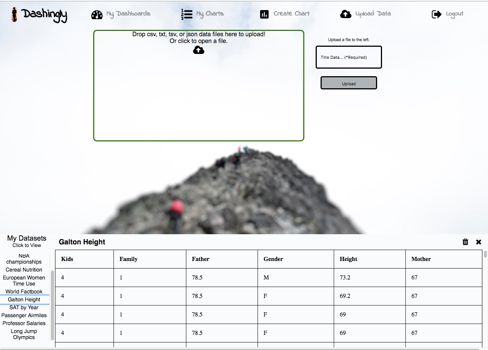
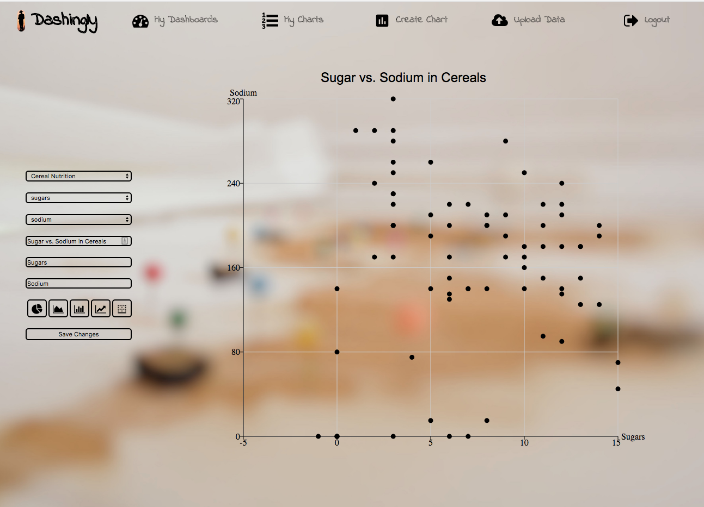
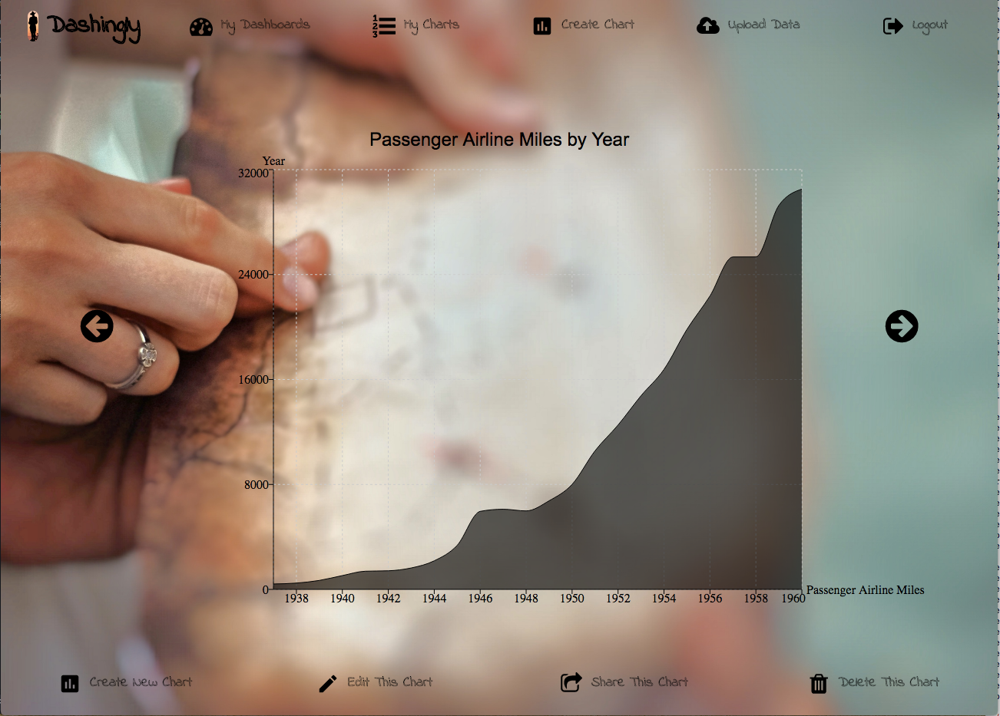

# Dashingly README

[Dashingly](https://dashing-ly.herokuapp.com/?#/login) is a single page online data visualization tool. It lets users upload data
in csv, tsv, txt, or json format, and make scatter, bar, line, area, and pie
charts with that data. Users can then share their creations with one another.

##Features

* Securely create accounts, login to an existing account, or sign in as a guest.
* Upload datasets in json, csv, tsv, or txt format using a drag and drop zone.
* View uploaded datasets in a table layout.
* Create bar, line, area, pie, and scatter charts.
* Select datasource and columns within datasource to customize chart.
* Edit existing charts.
* Remove unnecessary charts and datasets.
* Share charts with specific users.
* View all charts shared with you.

##Screenshots
Login Screenshot:

Upload Dataset Screenshot:

Edit Chart Screenshot:

Scrollable Chart View Screenshot:

##Technology Stack
* Dashingly uses a Postgres/Rails backend and a React frontend.
* Dashingly also benefits from the use of recharts, papaparse, and react dropzone.

##Project Planning
[See initial project plan here](docs/README.md)
* [Planned Wireframes](docs/wireframes)
* [Planned React Components](docs/component_hierarchy.md)
* [Planned Sample State](docs/sample_state.md)
* [Planned Database Schema](docs/schema.md)
* [Planned API endpoints](docs/api-endpoints.md)
